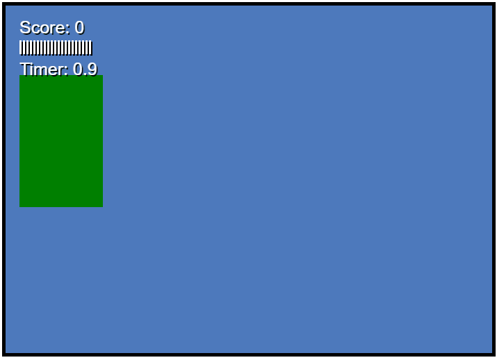

# 2d-game-js

## Descrição
Este projeto serve como base para a criação de jogos 2D. Foi desenvolvido utilizando JavaScript com orientação a objetos, proporcionando uma estrutura modular e reutilizável para o desenvolvimento de jogos.

## Tecnologias Utilizadas
- JavaScript
- HTML5 Canvas (para renderização gráfica)
- CSS (para estilização)

## Visual


## Instalação
Para clonar e rodar este projeto localmente, siga os passos abaixo:

1. Clone o repositório:
    ```bash
    git clone https://github.com/seu-usuario/2d-game-js.git
    ```
2. Navegue até o diretório do projeto:
    ```bash
    cd 2d-game-js
    ```
3. Abra o arquivo `index.html` no seu navegador preferido.
Este projeto está licenciado sob a Licença MIT. Veja o arquivo [LICENSE](LICENSE) para mais detalhes.